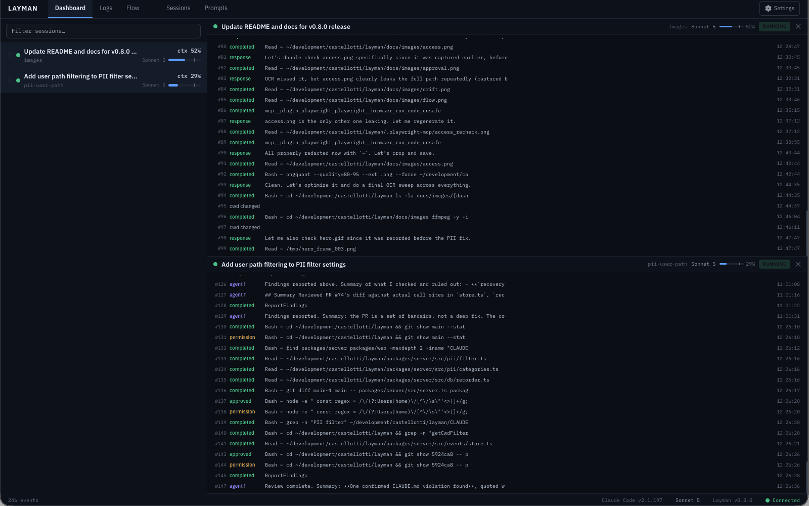
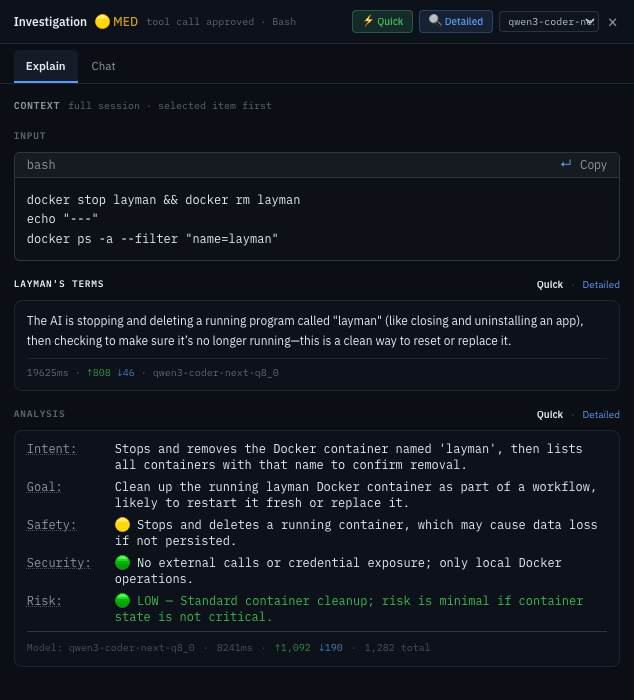
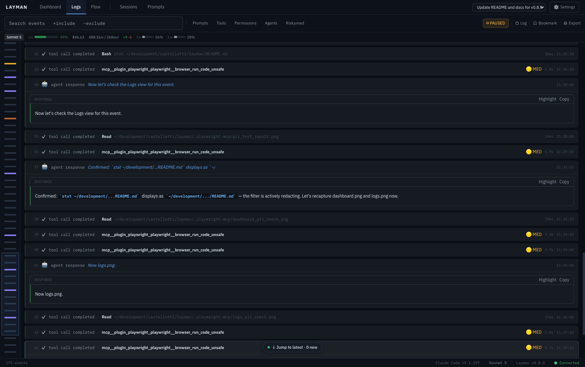
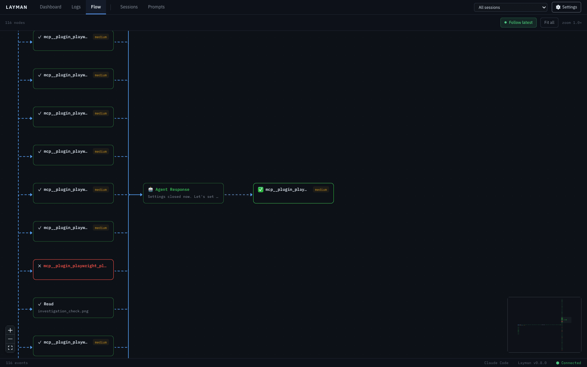
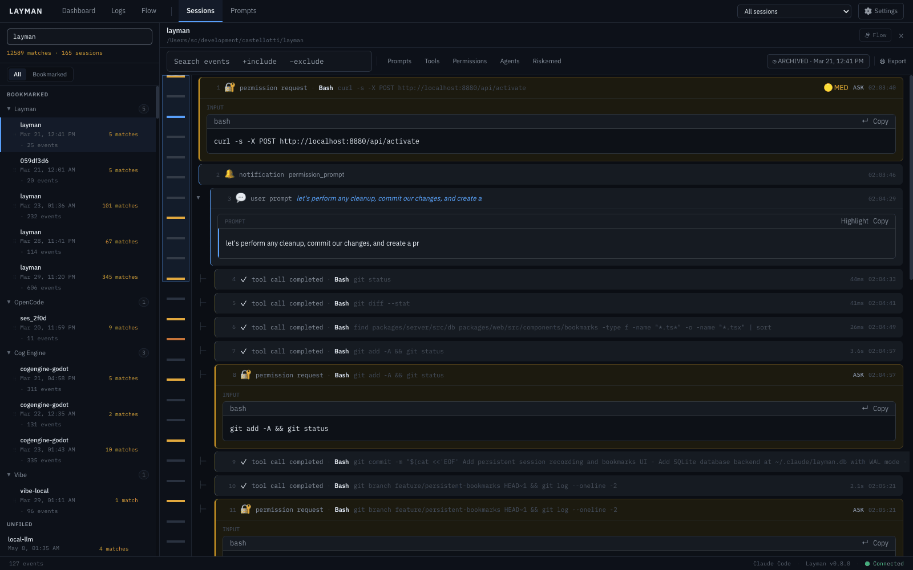
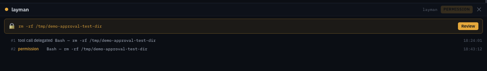

<!-- FINAL README — 1b Engineering-first base + 1a Features section + 1c Documentation table -->

# layman

[](LICENSE)
[](Dockerfile)
[](https://github.com/castellotti/layman/pkgs/container/layman)

Agentic insight and oversight - a local dashboard for monitoring AI coding agents.



Layman watches [Claude Code](https://github.com/anthropics/claude-code), [Codex](https://github.com/openai/codex), [OpenCode](https://github.com/anomalyco/opencode), [Mistral Vibe](https://github.com/mistralai/mistral-vibe), [Cline](https://github.com/cline/cline), [pi](https://pi.dev), and [Open WebUI](https://github.com/open-webui/open-webui) as they work:

- **Monitor** - live dashboard, exchange-tree logs with minimap, interactive flowchart with follow-latest camera
- **Explain** - plain-language "Layman's Terms" for every action; investigation chat with full-session context
- **Analyze** - automatic risk classification; drift scoring against your prompts and `CLAUDE.md`/`AGENTS.md` rules, with agent pause at red
- **Approve** - intercept tool calls before execution (Claude Code, Codex, OpenCode, Cline; opt-in for pi)
- **Record** - opt-in session recording to local SQLite, PII redacted by default; bookmarks, folders, full-content search; historical import from Claude Code JSONL transcripts

Runs in a container (Docker or Podman), binds to `127.0.0.1:8880` only. No accounts, no telemetry, no data leaves your machine.

## Quick start

Requires [Docker](https://docs.docker.com/get-started/get-docker/) or [Podman](https://podman.io/) (substitute `podman` for `docker` below; see [docs/installation.md](docs/installation.md#podman)).

```bash
# macOS / Linux
mkdir -p ~/layman && curl -fsSL https://raw.githubusercontent.com/castellotti/layman/main/docker-compose.ghcr.yml -o ~/layman/docker-compose.yml && docker compose -f ~/layman/docker-compose.yml up -d
```

```powershell
# Windows (PowerShell)
md -Force "$env:USERPROFILE\layman"; Invoke-WebRequest "https://raw.githubusercontent.com/castellotti/layman/main/docker-compose.ghcr.yml" -OutFile "$env:USERPROFILE\layman\docker-compose.yml"; $env:HOME=$env:USERPROFILE; docker compose -f "$env:USERPROFILE\layman\docker-compose.yml" up -d
```

Open **http://localhost:8880**, let the setup wizard install hooks for the clients it detects, then activate a session from your agent:

| Harness | Monitoring | Activation | Tool approval | Prompt from UI | Live tokens |
|---|---|---|:-:|:-:|:-:|
| [Claude Code](docs/harnesses/claude-code.md) | Hooks (26 event types) | `/layman` or auto-activate | ✅ | ❌ | ❌ |
| [Codex](docs/harnesses/codex.md) | Shell-script hooks | `$layman` per session | ✅ | ❌ | ❌ |
| [OpenCode](docs/harnesses/opencode.md) | Bidirectional plugin | `/layman` per session | ❌ | ✅ | ✅ |
| [Mistral Vibe](docs/harnesses/vibe.md) | Passive log watcher | Automatic | ❌ | ❌ | ❌ |
| [Cline](docs/harnesses/cline.md) | Shell-script hooks | `/layman` (Act mode) | ✅ | ❌ | ❌ |
| [pi](docs/harnesses/pi.md) | TypeScript extension | `/layman` or auto-activate | opt-in | ✅ | ✅ + thinking |
| [Open WebUI](docs/harnesses/open-webui.md) | Filter function | Automatic | ❌ | ❌ | ❌ |

Updating, stopping, mounts, and port binding: [docs/installation.md](docs/installation.md).

## Features

### Plain-language explanations

Select any event to see what it means in Layman's Terms, an AI risk analysis, and a chat to ask follow-up questions - with full-session context and a per-panel model selector.



### Logs built for long sessions

Events grouped into exchange trees with sub-agent lanes, a minimap for click-and-drag navigation, follow/pause controls, and `+include -exclude` search tokens (`⌘K`).



### Live flowchart

A directed graph of prompts, responses, and tool calls. The camera follows the newest node as the session runs; a minimap and **Fit all** let you jump anywhere.



### Record, bookmark, search

Opt-in session recording to local SQLite - with PII redacted before storage. Bookmark folders, newest-first history, and search that actually searches: names, paths, and full event content, with match navigation inside sessions.



### Tool approval

Intercept tool calls before they execute and approve, deny, or defer from the dashboard.



### And more

- **Risk analysis & drift monitoring** - automatic risk classification per action, plus goal-drift and `CLAUDE.md`/`AGENTS.md` rules-drift scoring that can pause the agent -> [docs/features.md](docs/features.md)
- **Multi-host sync** - run one central instance that collects sessions from many machines; each remote keeps recording locally and pushes to central, with clear host attribution, live remote sessions on the dashboard, and an optional offline mirror -> [docs/features.md](docs/features.md#multi-host-sync)
- **Session metrics** - model, context %, cost, tokens, rate limits, live per session
- **Historical import** - pull in past Claude Code sessions from JSONL transcripts, even ones never monitored live
- **File & URL access tracking** - everything touched, in one panel

## Configuration

**AI analysis (optional).** Risk classification, explanations, and drift monitoring use an LLM. Pass a key at startup - Anthropic, OpenAI-compatible, and LiteLLM endpoints are supported:

```bash
ANTHROPIC_API_KEY=your-key-here docker compose -f ~/layman/docker-compose.yml up -d
```

Thresholds, auto-explain/auto-analysis levels, and the model are configured in **Settings -> Automation**.

**Mounts and ports.** Layman needs read/write access to agent config directories (`~/.claude`, `~/.codex`, …) to install hooks; it only writes when you click **Install**. The dashboard binds to `127.0.0.1:8880` and has no authentication - do not expose it. Full reference: [docs/installation.md](docs/installation.md).

## Building from source

Requires Node 22+ and pnpm 10.

```bash
git clone https://github.com/castellotti/layman
cd layman
make install   # pnpm install
make dev       # server + web in watch mode
make test      # vitest across the workspace
make typecheck
```

Or build and run the container locally: `make docker-run` (see [Makefile](Makefile)). Workspace layout, architecture notes, and contribution guidelines: [docs/development.md](docs/development.md).

## Documentation

| Guide | Covers |
|---|---|
| [Installation & operation](docs/installation.md) | Quick start details, what gets mounted, port binding, updating, stopping, adding clients, running a central instance |
| [Features in depth](docs/features.md) | Risk analysis, drift monitoring, PII filter, access tracking, metrics, historical import, multi-host sync |
| [Claude Code](docs/harnesses/claude-code.md) · [Codex](docs/harnesses/codex.md) · [OpenCode](docs/harnesses/opencode.md) · [Vibe](docs/harnesses/vibe.md) · [Cline](docs/harnesses/cline.md) · [pi](docs/harnesses/pi.md) · [Open WebUI](docs/harnesses/open-webui.md) | Per-harness installation, activation, capability, and architecture notes |
| [glove](docs/extensions/glove.md) | Read-only passive monitoring of glove-sandboxed sessions |
| [Development](docs/development.md) | Building from source, workspace layout, testing, contributing |
| [CHANGELOG.md](CHANGELOG.md) | Release history |

## License

[MIT](LICENSE)
