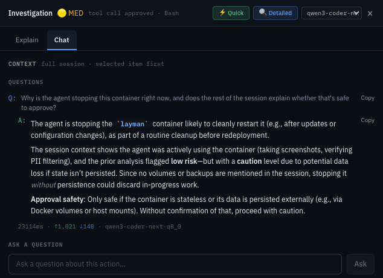
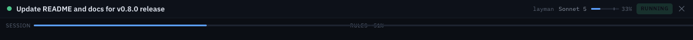
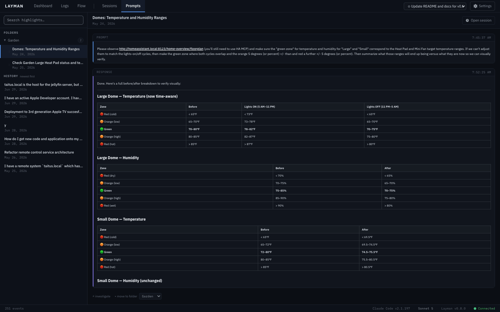
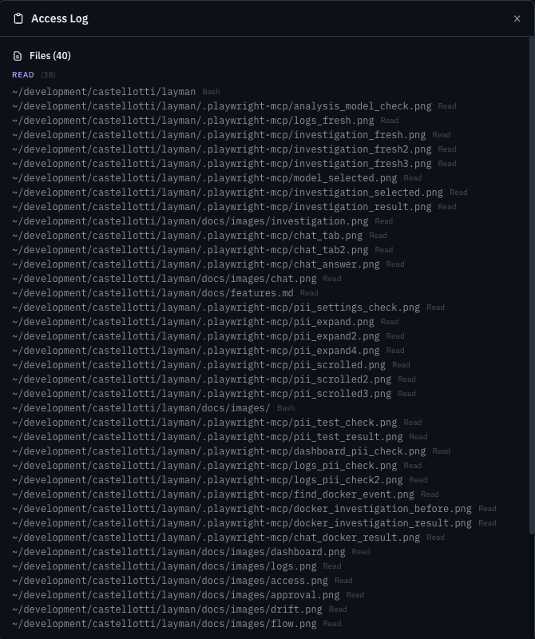
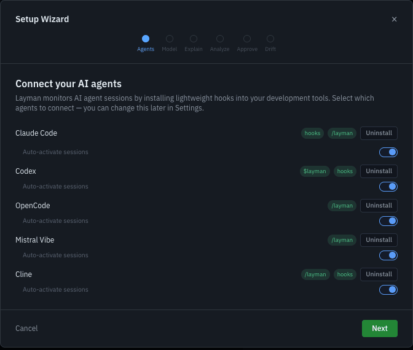

# Features in Depth

Deep-dives on Layman's analysis, safety, and recording features. For the view-by-view tour, see the [README](../README.md).

## Automated risk analysis

Layman can use an AI model to classify the risk level of each action, explain what it means in plain language, and flag anything that looks risky. Requires an API key - see [AI analysis setup](installation.md#ai-analysis-optional).

- **Auto-explain** and **auto-analysis** run in the background with configurable severity thresholds (All / Medium+ / High only) and detail level (Quick / Detailed).
- User-initiated requests jump ahead of background analysis in a priority queue.
- The Investigation panel's **Explain** tab shows the Layman's Terms explanation followed by the risk analysis; **Chat** answers follow-up questions. Both use full-session context assembled selected-item-first, and a model selector in the panel header overrides the analysis model for all panel functions.

**Chat** isn't limited to the selected event - ask it about the task or command in context, and it reasons across the whole session to answer.

## Drift monitoring

Layman continuously monitors AI agent sessions for two kinds of drift:

- **Session goal drift** - detects when the agent strays from what you asked it to do (scope creep, phantom file references, pattern breaks).
- **Rules drift** - detects when the agent violates rules defined in your project's `CLAUDE.md` files (wrong commands, forbidden actions, convention breaks). `AGENTS.md` files are also supported for harnesses besides Claude Code.

Drift scores are EMA-smoothed (alpha 0.3) to avoid reacting to one-off spikes. Scores map to three color levels (green -> amber -> red) with configurable thresholds. At **amber** the agent gets an in-context reminder; at **red** Layman can pause the agent entirely and require your approval to continue. Individual drift findings can be dismissed as false positives - dismissed items are fed back into the LLM prompt so they won't be re-flagged.

## Tool approval

For harnesses with pre-execution hooks (Claude Code, Codex, Cline), Layman can intercept tool calls before they execute and ask for your approval. Pending calls surface as callouts on the Dashboard and in Logs with **Allow / Deny / Defer** actions. Auto-approve levels (All / Medium / High / None) delegate low-risk calls automatically.

## Session recording, bookmarks, and search

Sessions can optionally be recorded to a local SQLite database, capturing user prompts, agent responses, permission requests, and tool calls. Recording is **opt-in**.

- **Sessions view** - bookmark folders above a newest-first **History** list, with keyboard navigation (↑/↓/Enter/Esc) and drag-to-reorder within folders.
- **Search** covers session names, working directories, and full event content. Matching sessions show match counts; inside a session, matched events are highlighted with ‹ › navigation between them.
- **Prompts view** - bookmark individual prompt/response pairs as Highlights, organized in the same folders + History structure, with a reading pane and **Open session** navigation.

## Historical session import

Layman can discover and import past Claude Code sessions from JSONL transcript files (`~/.claude/projects/`) that were never monitored live. **Settings -> Data** provides a scan dialog with per-session results and an optional auto-import-on-startup flag. Existing live sessions are enriched with missing events without downgrading their live status.

## PII filter

All logged events are automatically scanned for personally identifiable information (email addresses, API keys, passwords, credit card numbers, JWTs - 24 categories) and redacted **before storage**. Toggle in **Settings -> Data**.

## File and URL access tracking

Layman tracks every file the agent reads or writes and every URL it fetches during a session, surfacing them in a dedicated access panel so you can see exactly what was touched.

## Session summary

Each session header shows an AI-generated plain-English summary of what the agent did, updated live as the session progresses and available in history. Click the summary to see previous versions and timestamps.

## Session metrics

When connected to Claude Code, sessions show live metrics: model name, context window usage (exact `ctx NN%` with a meter), cumulative session cost, token counts, lines changed, and rate-limit warnings in the account limits strip.

## Setup wizard

First-run setup is guided by a wizard that detects installed AI clients and walks through configuration options.

